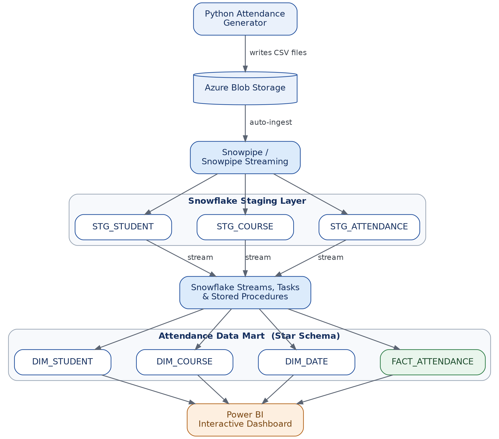

# Student Attendance Analytics Platform

## Project Overview 

The Student Attendance Analytics Platform simulates a real world attendance management and analytics system.
Attendance data is generated using a Python application and uploaded to Azure Blob Storage. Snowflake automatically ingests incoming attendance files using Snowpipe. Snowflake Streams, Tasks, and Stored Procedures performx incremental processing, validation, transformation, and loading into a dimensional  Data Mart.
The processed data is then send to Power BI to provide interactive dashboards for monitoring attendance performance across students, and courses.

## Architecture
 

## Tech Stack

| Component | Technology |
|---|---|
| Cloud Service | Microsoft Azure |
| Cloud Storage | Azure Blob Storage |
| Cloud Data Platform | Snowflake |
| ETL / ELT | Snowflake SQL, Streams, Snowpipe, Snowpipe Stream |
| Data Visualization |  Power BI |

## Power BI Dashboard

Interactive Power BI Report:
[View Student Attendance Dashboard](https://app.powerbi.com/links/w_hjhO8nV6?ctid=29bebd42-f1ff-4c3d-9688-067e3460dc1f&pbi_source=linkShare)

Access: Sign in required.

